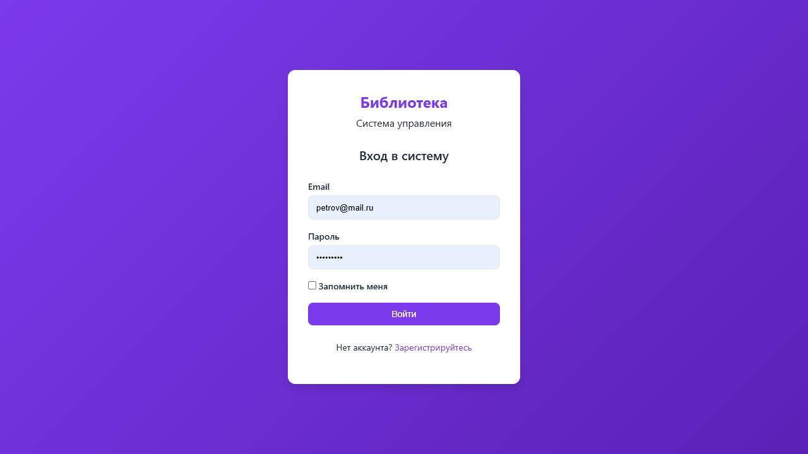
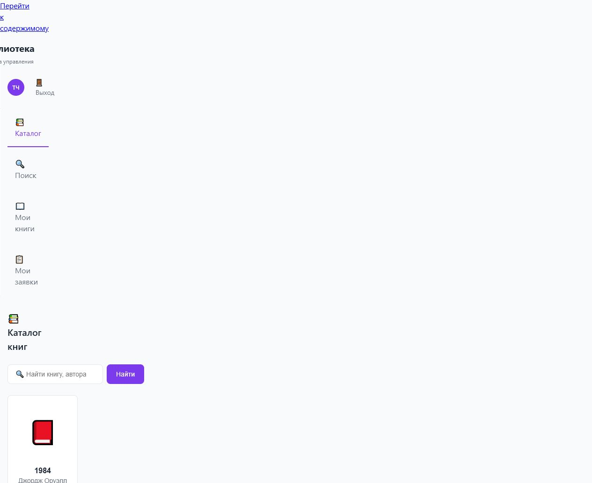
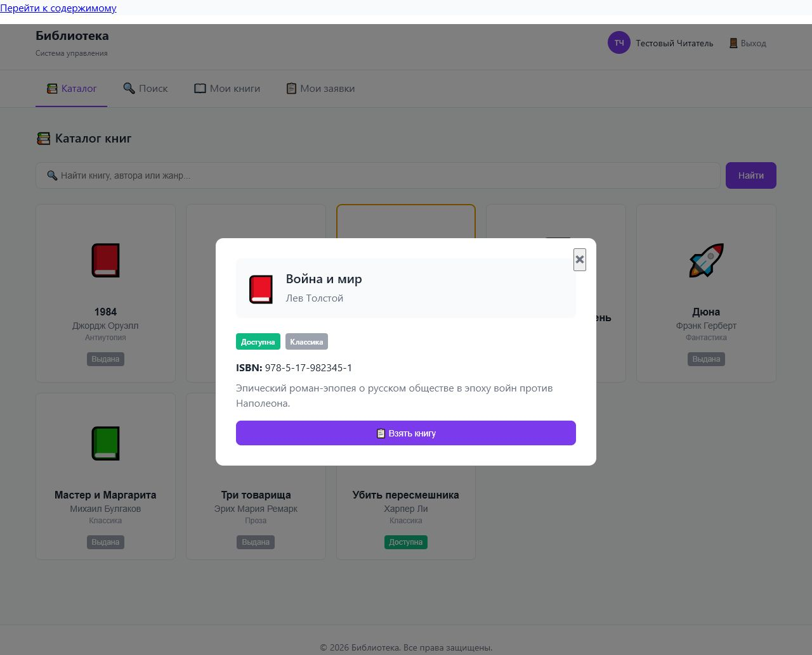
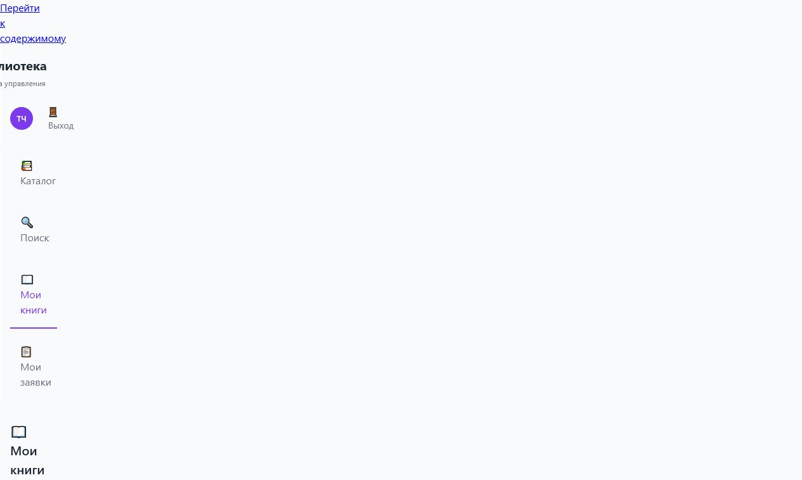
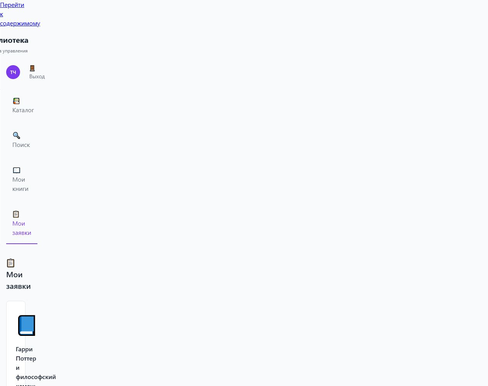
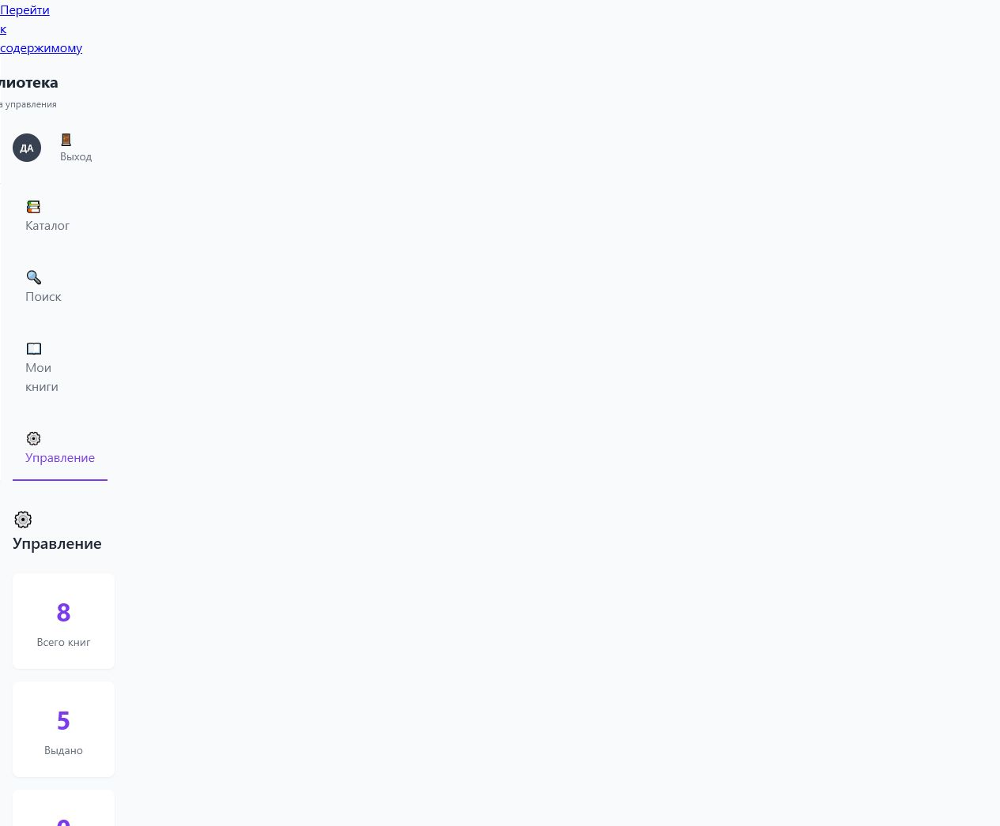
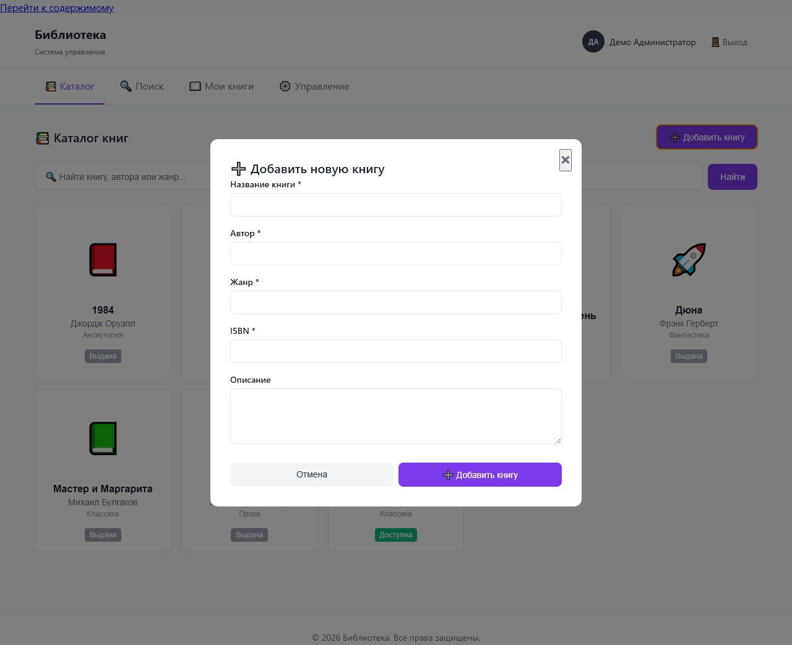

  

  <a href="#features">Features</a> ·
  <a href="#technology-stack">Stack</a> ·
  <a href="#run-the-project">Run</a> ·
  <a href="#demo-accounts">Demo accounts</a> ·
  <a href="#screenshots">Screenshots</a>

# Library Management System

Веб-сервис для управления библиотекой, каталогом книг и бронированиями.

## Features

- регистрация и авторизация;
- роли пользователя и администратора;
- каталог книг и быстрый поиск;
- бронирование книг;
- личный кабинет с книгами и заявками;
- административная панель: выдача, возврат, продление и обработка заявок.

## Technology stack

- Frontend: HTML5, CSS3, vanilla JavaScript;
- Backend: PHP 8;
- Database: MySQL;
- Other: Apache, PDO.

## Run the project

1. Создайте пустую базу данных `library_system` и последовательно импортируйте `database/schema.sql`, затем `database/seed.sql`.
2. Скопируйте `.env.example` в `.env` и укажите параметры локальной базы данных. Файл `.env` не добавляется в Git.
3. Откройте проект через локальный PHP/Apache-сервер и перейдите на его главную страницу.

## Demo accounts

| Роль | Логин | Пароль |
| --- | --- | --- |
| Тестовый пользователь | `reader@library.test` | `reader123` |
| Тестовый администратор | `admin@library.test` | `admin123` |

Это публичные демонстрационные учётные записи, созданные только для локальной проверки проекта. В репозитории нет личных паролей и реальных персональных данных.

## Screenshots

| Вход | Каталог |
| --- | --- |
|  |  |
| Карточка и бронирование | Личный кабинет |
|  |  |
| Заявки читателя | Админ-панель |
|  |  |
| Управление книгами | |
|  | |

## Project status

Учебный проект, созданный во время обучения в вузе и позже оформленный как портфолио-кейс.

## Known limitations

- нет автоматических тестов и CI;
- интерфейс рассчитан на одну библиотеку и локальное развёртывание.

## Development plans

- добавить пагинацию, фильтры и обложки книг;
- добавить тесты и автоматическую проверку качества кода;
- улучшить адаптивность и уведомления о сроках возврата.
